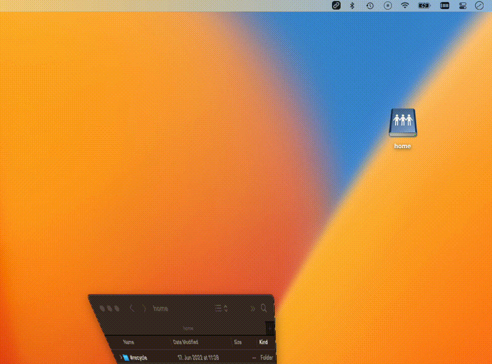

# LINKCONVERTER
Use Windows style Links on macOS.  

<br />  

**`\\server\folder`**  

↑  ↓  

**`smb://server/folder`**  
<br />

<hr>
<p align="center">
    <a href="#HOWTO">HowTo</a> • 
    <a href="#DRIVELETTERMAPPING">Drive Letter Mapping</a> • 
    <a href="#APPSTORE">AppStore</a> • 
    <a href="#NONAPPSTORE">Non AppStore</a> • 
    <a href="#LICENSEKEY">License Key</a> • 
    <a href="#MOUNTPOINT">Mountpoint</a> • 
    <a href="#MDM">MDM</a>
    <!-- <a href="#EULA">Eula</a> -->
</p>
<hr />
<br />

LinkConverter makes it easy to use `\\server\folder` style links on your mac. All you need to do is to copy a Link to the Clipboard.

## HOWTO

Copy Links from Text, `Microsoft Outlook` or anywhere else

   

<br />

Share your network files directly with `Finder Integration`  
   

---
## DRIVELETTERMAPPING

If you like, you can add config rules to map incoming Windows mounted links like `D:\folder` to your choice of UNC Link. This feature is also available via MDM config.  

---
## APPSTORE

You can get LinkConverter on the AppStore

[](https://apps.apple.com/de/app/linkconverter/id1604758881)

---
## NONAPPSTORE

If you like to get LinkConverter from outside the AppStore or if you are interested in large volume purchases, you can use a license key.  

### LICENSEKEY

For every Device where LinkConverter is installed, a valid License Token is necessary. If you like to try LinkConverter grab a test license at

https://lumibit.atlassian.net/servicedesk/customer/portals

The key will give you `7 days` to test all of LinkConverters features.

---
## KERBEROS

In the latest release, LinkConverter supports mounting favorite links:
- after launch
- after Apple Kerberos SSO Plugin finished connecting

A mount can be triggered, once the system notification informs LinkConverter, that connection is established.  
Notification: `com.apple.KerberosPlugin.ConnectionCompleted` 

Reference:  
https://www.apple.com/business/docs/site/Kerberos_Single_Sign_on_Extension_User_Guide.pdf

---
## MOUNTPOINT

We are taking your privacy and the integrity of your files, folders and data seriously.
LinkConverter has implemented the concept of [App Sandboxing](https://developer.apple.com/library/archive/documentation/Security/Conceptual/AppSandboxDesignGuide/AboutAppSandbox/AboutAppSandbox.html)

LinkConverter mounts links at
`/Users/.../Library/Containers/io.lumibit.mac.linkconverter/Data/Documents` followed by your file or folder.

This is by design and even if you already have a mounted drive with the same path under `/Volumes`.

---
## MDM

Deployment of LinkConverter via various MDM Solutions is possible, fast and easy.
You can use the `LinkConverter.pkg` file from this repository that is signed, packed and notarized for seamless work with Apple Gatekeeper.

License Management can be done with a `.mobileconfig` or `.plist`.  
A full example is available in `./mdm`.

```xml
<?xml version="1.0" encoding="UTF-8"?>
<!DOCTYPE plist PUBLIC "-//Apple//DTD PLIST 1.0//EN" "http://www.apple.com/DTDs/PropertyList-1.0.dtd">
<plist version="1.0">
        ...
            <key>mcx_preference_settings</key>
            <dict>
                <key>managedLicense</key>
                <string>YOURTOKEN</string>
                <key>managedDriveLetterMapping</key>
                <dict>
                    <key>D:</key>
                    <string>\\server\unc\folder</string>
                </dict>
            </dict>
        ...
</plist>
```

> :warning: Please replace **`YOURTOKEN`** in the example `.plist` with your license key and customize **`DriveLetterMapping`** Key as you like.
